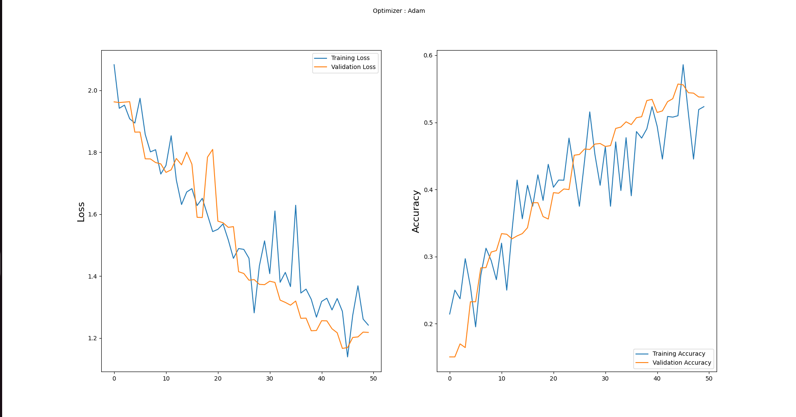
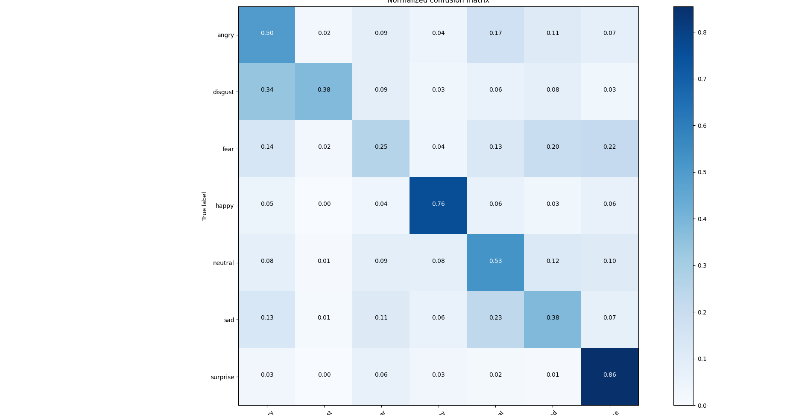

# Facial Expression Recognition


A deep learning model that classifies facial expressions into 7 categories: angry, disgust, fear, happy, neutral, sad, and surprise.

## Dataset

This project uses the FER2013 dataset from Kaggle. You need to download it separately and place it in the `data/fer2013/` directory.

### File Purpose Overview

- **data/fer2013/** - Contains the FER2013 dataset with images organized by emotion (angry, disgust, fear, happy, neutral, sad, surprise)
- **models/** - Stores trained model files for inference and deployment
- **results/** - Contains output visualizations that demonstrate model performance
- **src/train.py** - Main script to prepare data, build CNN architecture, train model, and save results
- **src/webcamdemo.py** - Test webcam demo for real-time facial expression recognition
- **app/main.py** - REST API for serving facial expression recognition predictions
- **app/test_predict.html** -  - Simple web interface for testing facial expression predictions via the API.
- **Dockerfile** - Containerizes the application for easy deployment
- **requirements.txt** - Lists all Python dependencies needed to run the project
- **README.md** - Project documentation and instructions
- **.gitignore** - Specifies files to exclude from version control (large datasets, cache files, etc.)
- **.dockerignore** - Specifies files and directories to exclude from Docker image builds.

## 🎯 Results

### Training Performance


### Model Accuracy
- Training Accuracy: ~95%
- Validation Accuracy: ~85%

### Confusion Matrix


## 🏗️ Model Architecture

The model uses a CNN architecture with:
- 4 convolutional layers with BatchNormalization and MaxPooling
- 2 fully connected layers
- Dropout for regularization
- Softmax output layer with 7 units (one for each emotion)

## 📊 Dataset

This project uses the FER2013 dataset from Kaggle. The dataset contains:
- 28,709 training images
- 3,589 test images
- 7 emotion categories: angry, disgust, fear, happy, neutral, sad, surprise

Download it from [here](https://www.kaggle.com/datasets/msambare/fer2013) and place it in the `data/fer2013/` directory.

### Installation

1. Clone this repository:
```bash
git clone https://github.com/your-username/facial-expression-recognition.git
cd facial-expression-recognition
```

### Usage

#### Train the Model
```bash
python3 src/train.py
```

#### Run Webcam Demo
```bash
python3 src/webcamdemo.py
```

#### Run the API Server
```bash
python3 src/main.py
```
Or using Docker:
```bash
docker build -t facial-expression-recognition .
docker run -p 5000:5000 facial-expression-recognition
```

#### Requirements
Install dependencies:
```bash
pip install -r requirements.txt
```